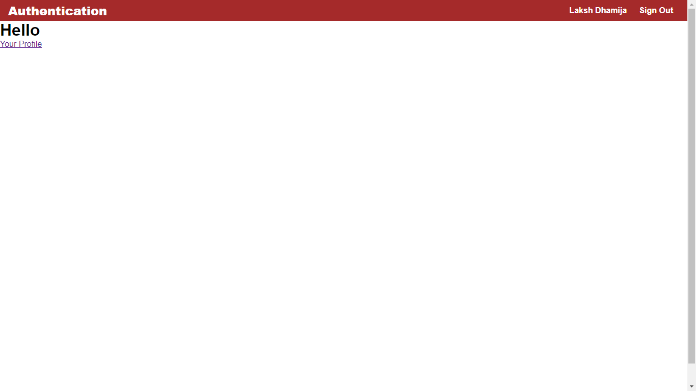

# Authentication

> This is a web project template with authenticaion setup to help save you time and effort.

---

### Table of Contents

- [Description](#description)
- [How To Use](#how-to-use)
- [Folder Structure](#folder-structure)
- [Author Info](#author-info)

---

## Description

Base project with various authentication methods already setup.

#### Technologies

- Javascript
- MongoDB
- ExpressJs
- NodeJs
- HTML
- CSS

---

## How To Use

#### Installation

1. Clone the repository to your system.
2. Open the project using VSCode and start the terminal.
3. Navigate to './config/passport-google-oauth2-strategy.js' in config folder and add clientID and clientSecret on lines 9 and 10 respectively which can be generated at 'https://console.developers.google.com/'
4. Run 'npm install' to install all the dependencies of the project.
5. Run 'npm start' to start the server. It is running on port 8000 of localhost.
6. Access projct though: http://localhost:8000

## Folder Structure

1. /views/ - Contains all the view-templates (using ejs in express)
2. /assets/ - Folder for all static files(css, js, images)
3. /controllers/ - Contains action methods for your application
4. /routes/ - Maps the application links to controllers
5. /models/ - Contains Schemas which are used in mongoDB
6. /config/ - Contains the configuration files
---

## Author Info

- LinkedIn - [@lakshdhamija](https://www.linkedin.com/in/laksh-dhamija/)
